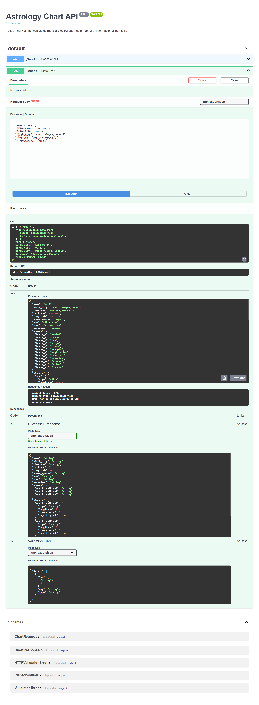

# Astrology Chart API


FastAPI service for real astrological chart calculation using Flatlib, Swiss Ephemeris and Docker.



---

## Overview

This project exposes a REST API capable of generating structured astrological chart data from birth information.

The service receives:

* Birth date
* Birth time
* Birth location
* Timezone

And returns:

* Sun sign and degree
* Moon sign and degree
* Ascendant
* House positions
* Planetary positions
* Retrograde status

The calculation engine is powered by **Flatlib** and **Swiss Ephemeris**.

---

## Why this project exists

Astrology-based applications often need a reliable calculation layer separated from the user interface.

This API was designed as a reusable backend service that can support:

* Web applications
* Member platforms
* Automation workflows
* Personal astrology dashboards
* AI-powered interpretation systems

---

## Architecture

```txt
Client
  ↓
FastAPI Route
  ↓
Pydantic Validation
  ↓
Geocoding Service
  ↓
Timezone Conversion
  ↓
Flatlib / Swiss Ephemeris
  ↓
Structured JSON Response
```

---

## Technology Stack

* Python
* FastAPI
* Pydantic
* Flatlib
* Swiss Ephemeris
* OpenCage Geocoding API
* Docker
* Pytest

---

## API

### Health Check

```http
GET /health
```

Response:

```json
{
  "ok": true,
  "service": "astrology-chart-api"
}
```

### Generate Chart

```http
POST /chart
```

Request:

```json
{
  "name": "Joana",
  "birth_date": "1990-08-15",
  "birth_time": "14:35",
  "birth_city": "São Paulo, Brasil",
  "timezone": "America/Sao_Paulo",
  "house_system": "equal"
}
```

Response:

```json
{
  "name": "Joana",
  "birth_city": "São Paulo, Brasil",
  "timezone": "America/Sao_Paulo",
  "latitude": -23.5505,
  "longitude": -46.6333,
  "house_system": "equal",
  "sun": "Leo 22.41",
  "moon": "Cancer 18.31",
  "ascendant": "Sagittarius",
  "houses": {
    "house_1": "Sagittarius"
  },
  "planets": {
    "sun": {
      "sign": "Leo",
      "longitude": 142.41,
      "sign_degree": 22.41,
      "is_retrograde": false
    }
  },
  "engine": "flatlib-swiss-ephemeris"
}
```

---

## Running with Docker

Docker is the recommended runtime because Flatlib depends on native Swiss Ephemeris packages.

```bash
copy .env.example .env
docker compose up --build
```

Open:

```txt
http://localhost:8000/docs
```

Run tests:

```bash
docker compose run --rm astrology-chart-api pytest
```

---

## Local Development

```bash
python -m venv .venv
.venv\Scripts\activate
pip install -r requirements.txt
pytest
uvicorn app.main:app --reload
```

---

## Environment Variables

```env
OPENCAGE_API_KEY=your_key_here
```

For local testing without an API key, the project includes fallback coordinates for a small set of Brazilian cities.

---

## Automated Testing

```bash
docker compose run --rm astrology-chart-api pytest
```

Current result:

```txt
2 passed
```

---

## What this project demonstrates

* API design with FastAPI
* Domain-specific calculations
* External service integration
* Geocoding workflows
* Timezone handling
* Dockerized deployment
* Automated testing
* Service-oriented architecture
